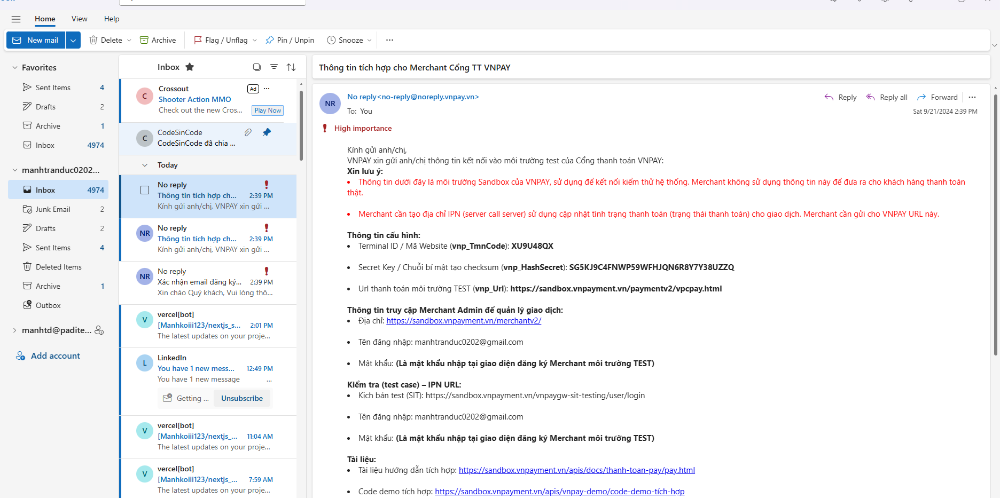

# Zalopay

vào vnpay developer => vào đăng kí test `https://sandbox.vnpayment.vn/devreg`

tài liệu hướng dẫn có gửi kèm theo mail

Sau khi đăng kí tài khoản thì có mail gửi về => 2 mail

- 1 mail có thông tin về tài khoản
- 1 mail có thông tin về api key và secret key



khai báo api (services/payments) => khia báo trong env có url khi thanh toán thành công => tạo pages/payment/index.tsx

# next auth

dự án này trên email manhtd@paditech.com => create => api & services

=> vào oauth conse..... => extenal => tieps tục save and continue

=> vào credential => create credential => oauth client=> điền cái redireact origins.. => `http://localhost:3000/api/auth/callback/google` => ra keys

khi đăng nahapaj bằng fb => client call 1 api đến fb => fb trả về nhiều cái trong đó có accToken => cầm cái aT đó gọi lên server => server call lên fb 1 lần nữa xem có hợp lệ hay ko => nếu có => trả về tt user cho server => lưu vào db (với sign up)

=> vấn đề tại sao client call đến fb rồi fb trả tt user rồi mà ko gửi lên cho server luôn => tại sao lại cần validate lần nữa => bảo mật thôi

## setup next auth

docs `https://next-auth.js.org/getting-started/example`

yarn add next auth

làm theo docs đã => TẠO ENV => ok base setup

## Xử lý đăng nhập, đăng ký với Google (OAuth)

## setup cho đăng nhập đăng kí fb

vào fb dev (meta for dev) => ud của tôi => tạo ud => xác thực yêu cầu...=> OK => import trong nexxtauth.ts

vào cái vừa tạo trên fb dev => chọn web vừa tạo => cài đặt ứng dụng => tt cơ bản => copi id

# 229. Dynamic SSG với getStaticPaths trong page router

ví dụy muốn call api detail ở phía server => tạo ra file json tương ứng => sử dụng `getStaticPaths` để cung cấp cho `getStaticProps` => tạo ra các file josn động

code ví dụ

```ts
export default function PostDetail ({data} :any) {
    return {
        //render giao diện
    }
}
export function getStaticPaths() {
    return {
        paths:{
            params:{
                postId:'1' // /post/1 => mới có , /po/2 => page not found
            },
            params:{
                postId:'2' // /post/2 => mới có , /po/3=> page not found
            }
        },
        fallback:false
    }
}
export async function getStaticProps(context:any) {
    console.log(context);
    const id  = context.params.postId
    const res = await fetch .... // api động theo cái id
    const data = await res.json()
    return {
        props :{
            data
        }
    }
}
```

=> khi đó log thằng context ra sẽ có `params:{postId:"1"}`

=> thấy cái truyền path kia phức tạp v

call api bên trong cái `getStaticPaths` luôn

```ts
export async function getStaticPaths() {
    const res = await fetch .... // api all post
    const listPost = await res.json()
    const path = listPost.map((item) => {
        return {
            params:{
                postId:String(item.id)
                }
        }
    })
    return {
        paths:path,
        fallback:false
    }
}
```

=> khi build tạo file json sẵn => truy cập vào => ví dụ trang home có button sng post => có pre rendering (list) trước rồi => vào list pót call cái api detail của file json

khi vào detail => ko trả về filw html nữa

# 230. Tìm hiểu về fallback trong getStaticPaths

## fallback là false

thì mặc định k có trong path thì nó đá về 404

khi build => vào .next => server => chỉ sinh ra các file html có trong cái path thôi

## fallback là true

với các cái ko có trong path => nhưng vẫn trả ra cái data => tự động ra 1 trnag tuwog ứng và trả ra cho mình có thể bắt loading của nó

```ts
export default funtion PostDetail({data}:any) {
    const router = useRouter()
    if(router.isFallback) {
        return <div>Loading...</div>
    }
}
```

=> khi đố các route ko có sẵn trong path thì có cái loading trước

khi build lên => chỉ sinh ra các path có nhưng khi truy cập vào path ko có trog path => lading và gen ra cái page này => trong server sẽ tự có file này và sau này truy cập lại thì sẽ tự có mà dùng rồi

## fallback là 'blocking'

=> tương tự như `true` => nhưng ko có `isloading`

khi build giống như `true`

khác nhau

với true => gen page ở phía server, id nào cũng được ko trả về notfound

với blcoking => ko cần đợi loading và khi deploy => có 1 cái `output` trong `config` => sinh ra 1 folder `output`=> ko dùng được chỉ dùng được với true thôi

muốn mà id ko tồn tại => trả về 404 chứ ko trả ra page ko có thông tin

```ts
export async function getStaticProps(context:any) {
    console.log(context);
    const id  = context.params.postId
    const res = await fetch .... // api động theo cái id
    const data = await res.json()
    if(!data?.id) { // hawojc điều kiện gì đó
        return {
            notFound: true
        }
    }
    return {
        props :{
            data
        }
    }
}
```

=> nên dùng true và false thôi

# 231. Phân tích vấn đề của static site generation

=> ưu điểm nhanh, dễ deply

=> nhược => dữ liệu trong cache

vấn đề: build lên => tạo 2 trang 1 và 2 (trong path có 2 cái này thôi) => khi vào trang /post(list) => sinh ra thêm thằng số 3 (trong db có thằng này) => nn là do nextjs check cái href có đường link nào (list post có 3 bài mỗi bài là 1 link đến detail) => tải trước => sinh ra thằng 3 => tạm thời bỏ cái link sang đi (chỉ là 1 text hiển thị bình thường thôi)

case khi update cái db của thằng 3 => build => sử dụng data cũ => sai (do đã build 2 file 1 2 =>khi truy cập vào trang 3 thì tải mới trang 3 khi build trang 3 thành file json)

=> build lại thì mới ăn data mới => build mất thời gian

=> nhược điểm 2 =>data ko liên tục được

# 232. Incremental static regeneration trong NextJS (ISR)

với ISR thí nó cho phép mình cập nhật lại các trang tĩnh sau khi đã build ứng dụng

thay vì tạo ra hoặc cập nhật toàn bộ trang mỗi khi trang thay đổi thì isr chỉ tạo ra hoặc cập nhật các phần mà thực sự cần thay đổi

## sử dụng khi nào

1. khi cần thêm revalidate vào trong props ở `getStaticProps`
2. sau khoảng thời gian revalidate thì khi mình gửi 1 request thì next sẽ tái tạo lại trang (tái tạo là ví dụ có 1 danh sách bài post => next copy cái data list => cập nhật list post từ bản sao chép => từ lần tiếp theo thì dùng cái bản sao chép)

ví dụ set revalidate = 30s, nếu trang đã được tạo trước đó 30s rồi thì quá trình tái tạo trang sẽ được thực hiện

```ts
export async function getStaticProps(context:any) { // (1)
    console.log(context);
    const id  = context.params.postId
    const res = await fetch .... // api động theo cái id
    const data = await res.json()
    if(!data?.id) { // hawojc điều kiện gì đó
        return {
            notFound: true
        }
    }
    return {
        props :{
            data
        },
        revalidate:10 //sau khoảng 10s tái tạo lại danh sách bài post
    }
}
```

khi build sẽ có 1 cái bản copy có cái (10 second đằng sau) => build xong sau 10s => gửi 1 cái yêu cầu (như f5 lại) => f5 lại 3 lần trong khaogr dưới 10s từ khi build xong => chỉ chạy cái (1) 1 lần duy nhất thôi

chỉ đang tái tạo lại cái trang thôi (tạo html mới ) => f5 lại mới có dữ liệu mới (đợi request tiếp theo)

ví đụ đang ở /post/1 thì f5 lại f5 lại để chạy lại cái `getStaticProps` => vào lại trang /2 => vẫn ăn dữ liệu db cũ (phải f5 tại màn này thì mới ăn dữ liệu mới)

# 233. getServerSideProps trong page Router

`getServerSideProps` thực thi ở mỗi request tức là mỗi khi có 1 req đến trang (thực thi khi vào trang)

`getStaticProps` thực thi tại thời điểm build time, tức là khi bạn build project hoặc deploy. Nó chỉ thực hiện 1 lần và dùng cache trong môi trường production

khi nào sử dụng

`getServerSideProps` thường dùng khi fetch dữ liệu có thể thay đổi thường xuyên hoặc dựa trên thông tin của mỗi request (ví dụ trang chi tiết sản phẩm, trang đăng nhập)

`getStaticProps` thường dùng cho dữ liệu tĩnh, ít thay đổi và ko phụ thuộc vào context của mỗi request(ví dụ trang bài viêt, trang giới thiệu (landing page))

`getServerSideProps` dùng tương tự như `getStaticProps` nhưng ko có cái revalidate
